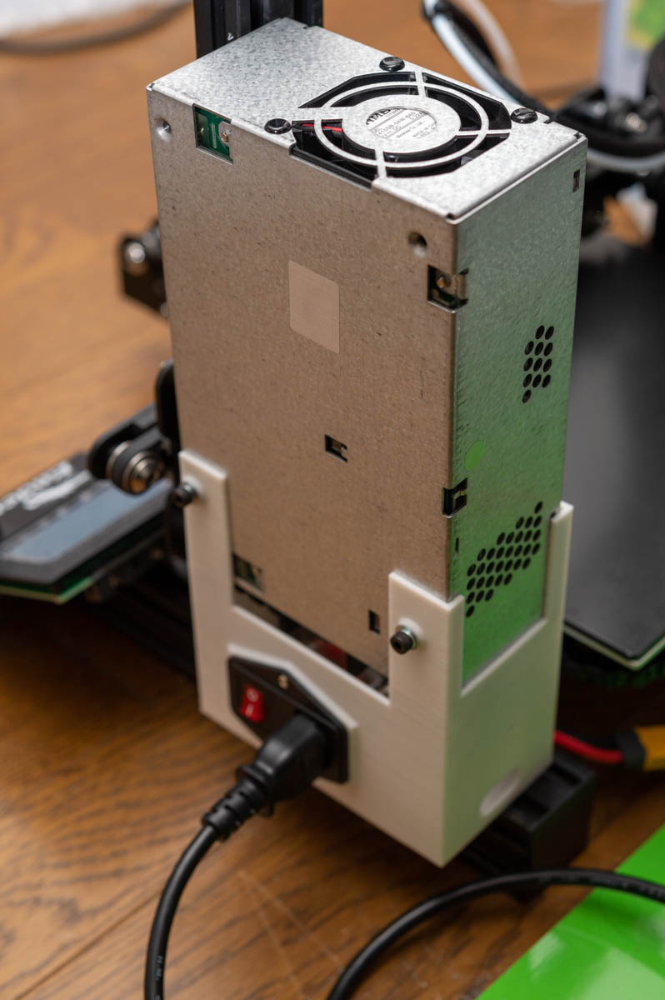
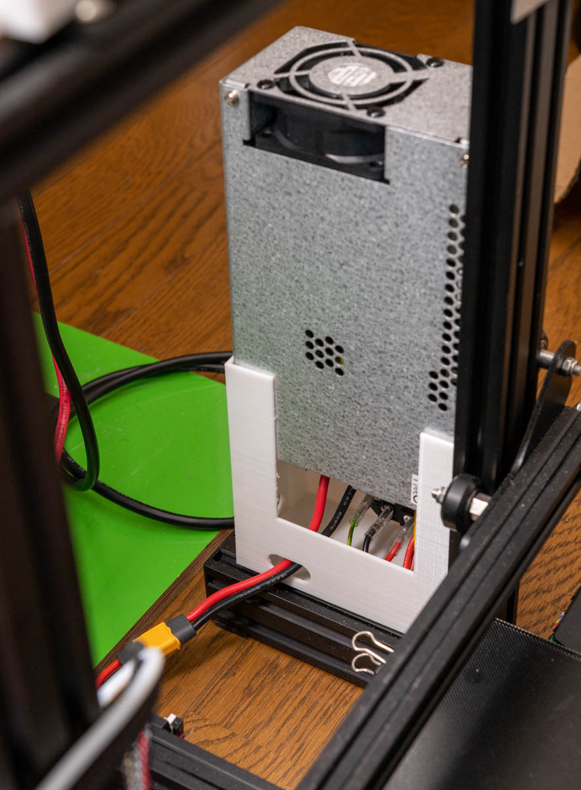
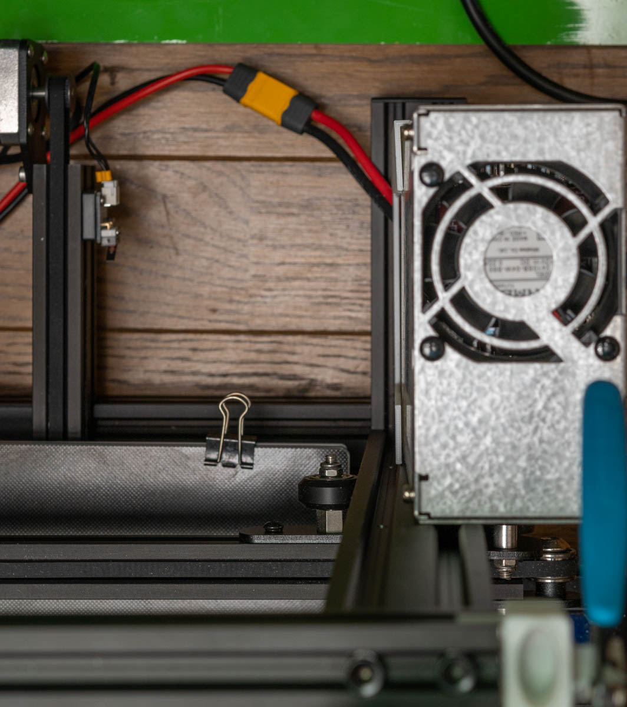
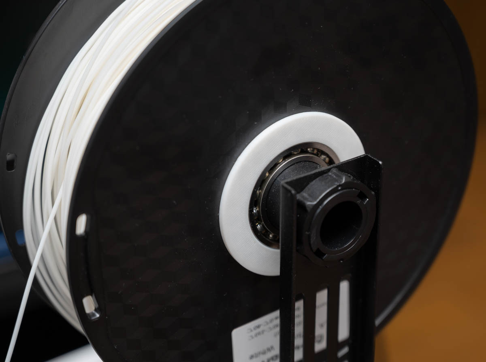

# psu_mount.stl

## Requirements

* Printer
    * Creality Ender-3 V2
* PSU
    * TDK-Lambda RWS600B-24
* Cable
    * Amass XT60H-M to M5 cable lug
    * AWG 12
* AC inlet
    * Huaconn HC-99-F5
    * M3.5 cable lug
    * Can be reuse inlet of Ender-3 stock PSU
* Screws
    * M4x10mm screw and washer * 2
    * PSU Mount bolt
        * M4x8mm screw and washer * 2
        * ...or reuse Ender-3 PSU mount bolts
    * M4 T-nut * 2

# spool_6906.stl

## Requirements

* Printer
    * Creality Ender-3 V2
    * To insert the bearing, the filament spool retainer of the spool holder needs to be scrape off
* Bearing
    * 6906 x2
        * Two bearings are needed because both sides of the filament spool need to be held.
* Filament
    * Compatible with spool inner diameter of 57mm
        * Pxmalion's 1.75mm PLA filament and others
